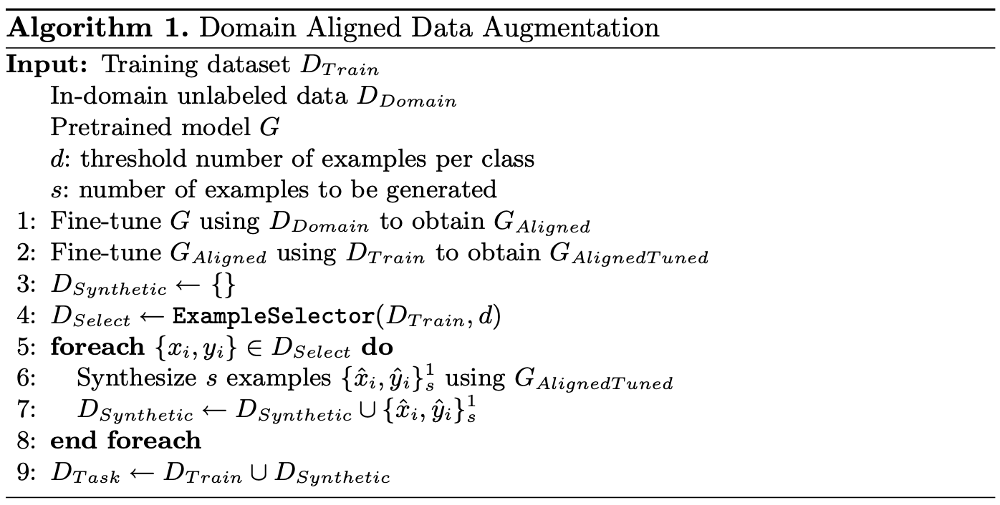

# Domain-Aligned Data Augmentation for Low-Resource and Imbalanced Text Classification

This repository hosts the implementation described in our paper ["Domain-Aligned Data Augmentation for Low-Resource and Imbalanced Text Classification"](https://doi.org/10.1007/978-3-031-28238-6_12). 
It is based on ["Data Augmentation Using Pre-trained Transformer Models"](https://aclanthology.org/2020.lifelongnlp-1.3.pdf), which it extends by introducing domain alignment and processing of longer texts.

The paper proposes the alignment of existing generic models in task-specific unlabeled data , in order to create better synthetic examples and boost performance in Text Classification tasks. 

We evaluate in-domain alignment using Decoder-only, Encoder-only and Encoder-Decoder models, using a variety of domain-specific data, in both in-domain and out-of-domain benchmark datasets. We further evaluate the effectiveness of our data augmentation approach in both low-resource and imbalance settings and draw conclusions about the required volume of in-domain data, depending on model size. The following algorithm describes our proposed approach. 




# Cite as: 
Stylianou, N., Chatzakou, D., Tsikrika, T., Vrochidis, S., Kompatsiaris, I. (2023). Domain-Aligned Data Augmentation for Low-Resource and Imbalanced Text Classification. In: , et al. Advances in Information Retrieval. ECIR 2023. Lecture Notes in Computer Science, vol 13981. Springer, Cham. https://doi.org/10.1007/978-3-031-28238-6_12


```bibtex
@InProceedings{10.1007/978-3-031-28238-6_12,
author="Stylianou, Nikolaos
and Chatzakou, Despoina
and Tsikrika, Theodora
and Vrochidis, Stefanos
and Kompatsiaris, Ioannis",
editor="Kamps, Jaap
and Goeuriot, Lorraine
and Crestani, Fabio
and Maistro, Maria
and Joho, Hideo
and Davis, Brian
and Gurrin, Cathal
and Kruschwitz, Udo
and Caputo, Annalina",
title="Domain-Aligned Data Augmentation for Low-Resource and Imbalanced Text Classification",
booktitle="Advances in Information Retrieval",
year="2023",
publisher="Springer Nature Switzerland",
address="Cham",
pages="172--187",
abstract="Data Augmentation approaches often use Language Models, pretrained on large quantities of unlabeled generic data, to conditionally generate examples. However, the generated data can be of subpar quality and struggle to maintain the same characteristics as the original dataset. To this end, we propose a Data Augmentation method for low-resource and imbalanced datasets, by aligning Language Models to in-domain data prior to generating synthetic examples. In particular, we propose the alignment of existing generic models in task-specific unlabeled data, in order to create better synthetic examples and boost performance in Text Classification tasks. We evaluate our approach on three diverse and well-known Language Models, four datasets, and two settings (i.e. imbalance and low-resource) in which Data Augmentation is usually deployed, and study the correlation between the amount of data required for alignment, model size, and its effects in downstream in-domain and out-of-domain tasks. Our results showcase that in-domain alignment helps create better examples and increase the performance in Text Classification. Furthermore, we find a positive connection between the number of training parameters in Language Models, the volume of fine-tuning data, and their effects in downstream tasks.",
isbn="978-3-031-28238-6"
}
```

# Acknowledgements
This project has received funding from the European Union’s Horizon 2020 research and innovation programme under grant agreements No 101021797 (STARLIGHT) and No 833464 (CREST).